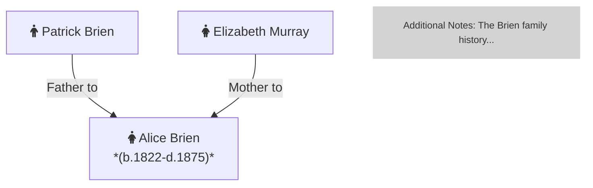
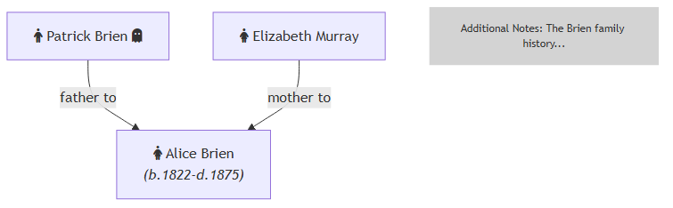

# Create Tree using Mermaid

## Setup

1. Install npm (choco install nodejs)

2. Install mermaid-cli using this line escalated:
 

    npm install -g @mermaid-js/mermaid-cli

3. Compile mermaid files using:

    mmdc -i .\obrien.mmd -o .\obrien.png

## Code Example

See this example for a basic tree structure

This is how this looks in png:

## External Links

https://github.com/mermaid-js/mermaid-cli

https://mermaid.live/

Font Awesome: 
https://fontawesome.com/search

